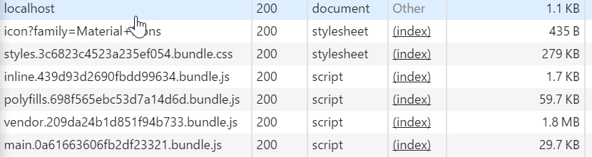

# Micro-service Application Template
*@javajosh 2017*


## Introduction

> There are only two hard things in Computer Science: cache invalidation and naming things. <br><br>
> -- Phil Karlton

This repo is a micro-service template with one directory (module) per *top-level process*: 
`client`, `server`, and `db`. In this case, the client is browser/angular, server is
java/play, and db is linux/mysql. This project is buildable from the 
command-line in macOS, Windows, and Linux. 

This repo includes IntelliJ project files, but an IDE is optional, and *the 
command-line will always be the canonical way to build*.


## Building, Running, Testing

First, install the necessary tooling: `java`, `sbt`, `yarn`, `@angular/cli`, `mysql`, and `git`.
Installing the required tooling is made much easier if you use a package manager. 
I suggest homebrew for macOS, chocolatey for Windows, and apt-get or rpm
for Linux. Install the Oracle JDK manually. Optional (but very useful) packages
include mysql.workbench and curl. Note that installing `yarn` will also typically install
`node` and `npm`.

Each top-level process is built, run, tested separately. Unlike most templates of this
type, you don't have to run all processes at once. You can run any of them independently,
and they will use local stubs to keep going. In general, since applications are for humans,
follow a *top-down* approach, starting with the UI, and working down to implement the necessary
features.

The *initial build* for these projects will take extra time and bandwidth
as they download their (copious) dependencies. Subsequent runs will be much faster.

If you use IntelliJ, install the `Scala` and `AngularJS` plugins.


### Run the Client (Angular)

`yarn install` but then you need to [install node-sass](https://github.com/sass/node-sass/issues/1579#issuecomment-227661284) separately:

```$bash
npm update
npm install
nodejs node_modules/node-sass/scripts/install.js
npm rebuild node-sass
```

Start a development session with `ng serve -o`. This command will start a persistent development server
with live-reload, and open a new default browser at [http://localhost:4200](http://localhost:4200).

Build for production with `ng build --prod`, which will output to `dist/`. (Angular
includes a powerful set of tools for minimizing and tree-shaking, however even
the simplest client will be ~300kB.) (A good option for testing production output is to `npm install -g http-server` and then run `http-server` from within the `dist/` folder.)

There are many other helpful `ng` commands for generating code, linting,
testing and more.

The runtime is built on JavaScript, HTML, and CSS. The build is 
built on TypeScript, Angular Template Language, and SCSS.

Note: even for a very basic client, the *production* build is huge, over 2MB, which is mostly dependency javascript. (In this example there is 1.8MB of dependency, and 30kB of application script). 



### Run the Server (Play)

Start a Play Framework development session with `sbt run`.
Access with  [http://localhost:9000](http://localhost:9000).

Note: `sbt` requires access to `javac`, so put it on the path (on windows, search
for "enviroment variables" on the start menu).

### Run the DB (MySQL)


## Collaborative Development

## Ideas

Use Liquibase for DB migration; JDBI for server/DB comms. Use Jersey for REST. 
Use `nginx` in reverse-proxy to integrate client and server under a single port.
Experiment with integrating client/server build. 


## How this project was initialized

The initial commit contains the result of this recipe:

 0. Install git, yarn, sbt, and ng, plus all of their requirements. 
 1. `git init microservice`
 2. `cd microservice`
 3. `sbt new playframework/play-java-seed.g8 server`
 4. `ng new --router client`
 5. Various fiddling with IntelliJ to setup the module structure.
 
Later I added the [Angular Material](https://material.angular.io/) component library, `yarn add @angular/material`. This includes basic things like checkboxes, dropdowns, with themable styles and so on.

Even later, I added the excellent [Teradata Covalent](https://teradata.github.io/covalent/#/docs) components. Provides more advanced components, in particular a grid component.